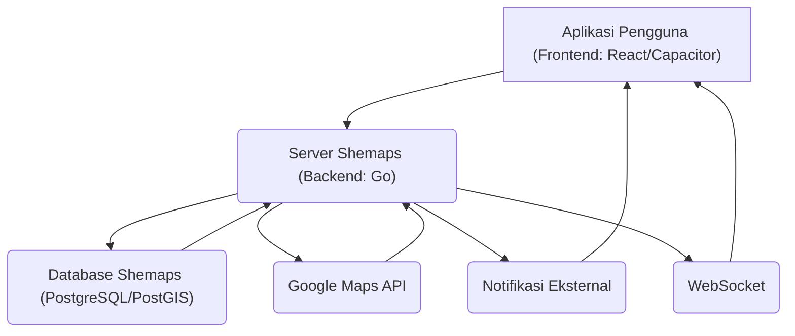

# Shemaps
Shemaps adalah aplikasi navigasi mobile inovatif yang dirancang dengan prioritas utama pada keselamatan personal penggunanya. Berbeda dengan aplikasi peta konvensional yang fokus pada kecepatan dan efisiensi rute, Shemaps bertujuan untuk memberikan ketenangan pikiran dengan merekomendasikan rute yang telah dianalisis dari segi keamanan. Aplikasi ini ditujukan untuk individu yang peduli dengan keamanan dalam perjalanan mereka, dengan fokus khusus untuk memberikan rasa aman bagi perempuan. Shemaps mengatasi kecemasan dan risiko yang muncul saat bernavigasi di area yang tidak dikenal, gelap, atau rawan, masalah yang seringkali tidak dijawab oleh aplikasi peta pada umumnya.
## Filosofi Produk
- **Eliminate:**
	- Rute yang melewati area rawan kejahatan, gang sempit, atau area terpencil.
	- Navigasi di jalan gelap tanpa penerangan yang memadai.
	- Informasi lokasi yang tidak akurat atau usang.
	- Fitur yang rumit dan tidak _user-friendly_ saat darurat.
- **Reduce :**
	- Waktu respons sistem saat menggunakan _panic button_.
	- Konsumsi baterai dengan optimasi GPS dan visual.
	- Kompleksitas antarmuka dengan desain yang lebih sederhana.
	- Ketergantungan pada data internet dengan mode _offline_.
- **Raise :**
	- Tingkat keamanan dengan verifikasi lokasi _real-time_.
	- Keterlibatan komunitas dalam pelaporan keamanan.
	- Kualitas visualisasi rute untuk area pedestrian.
	- Kecepatan koneksi ke layanan darurat.
- **Create:**
	- _Panic button_ terintegrasi dengan kontak darurat dan pelaporan ke pihak berwenang/layanan transportasi _online_.
	- Sistem pewarnaan jalan pada peta berdasarkan tingkat keamanan.
	- Fitur _safe zone_ dan _meeting point_ khusus perempuan.
	- Jaringan dukungan komunitas dan basis data area tidak aman.

## Fitur Utama
### Intelligent Safe Routing
- **Apa Itu:** Shemaps menyediakan rute navigasi yang tidak hanya mempertimbangkan jarak atau waktu tempuh, tetapi juga tingkat keamanan.
- **Cara Kerjanya:** "Saat Anda meminta rute, sistem kami tidak hanya bertanya pada Google Maps. Ia juga memeriksa 'peta bahaya' internal kami yang datanya berasal dari laporan komunitas. Rute yang melewati area rawan akan diberi skor bahaya dan dihindari, atau ditandai dengan jelas."
### Peta Keamanan Berbasis Komunitas**
- **Apa Itu:** Sebuah peta interaktif yang menampilkan laporan keamanan dari pengguna lain, menciptakan basis data keamanan yang dinamis.
- **Cara Kerjanya:** "Setiap pengguna, bahkan pengguna tamu tanpa akun, bisa melaporkan area yang mereka anggap rawan (berbahaya, hati-hati) atau aman. Laporan ini langsung muncul di peta untuk dilihat semua orang, menciptakan peta keamanan yang hidup dan selalu _update_ dengan ikon dan warna yang berbeda sesuai tingkat bahaya."

### Panic Button dengan Peringatan Komunitas & Kontak Darurat
- **Apa Itu:** Sebuah tombol darurat yang, saat diaktifkan, mengirimkan peringatan ke komunitas Shemaps terdekat dan kontak darurat pribadi.
- **Cara Kerjanya:** "Dengan menahan satu tombol (fitur _long press_), status darurat Anda akan langsung disiarkan ke pengguna Shemaps lain di sekitar melalui notifikasi _in-app_. Sistem juga secara otomatis mengirimkan notifikasi SMS/Push ke daftar kontak darurat pribadi yang sudah Anda atur sebelumnya."

### Pengguna Tamu (Frictionless Onboarding)
- **Apa Itu:** Kemampuan untuk menggunakan fitur inti aplikasi tanpa perlu membuat akun terdaftar.
- **Cara Kerjanya:** "Anda bisa langsung menggunakan fitur-fitur inti seperti melihat rute aman dan melapor tanpa perlu mendaftar. Aplikasi secara otomatis memberikan identitas anonim untuk perangkat Anda, dan semua kontribusi Anda bisa disinkronkan nanti jika Anda memutuskan untuk mendaftar dengan email/password."

## Alur Penggunaan Aplikasi
1. **Membuka Aplikasi Pertama Kali:** Pengguna mengunduh dan membuka Shemaps. Mereka disambut dengan peta utama yang menampilkan lokasi mereka saat ini. Aplikasi secara otomatis menetapkan mereka sebagai "pengguna tamu" dengan ID perangkat unik, memungkinkan mereka langsung menjelajahi fitur tanpa perlu mendaftar.
2. **Mencari Destinasi:** Pengguna mengetuk bilah pencarian di bagian bawah layar dan memasukkan tujuan mereka.
3. **Melihat Rute Aman:** Setelah memilih tujuan, Shemaps menampilkan beberapa opsi rute. Setiap rute diwarnai (hijau untuk aman, kuning untuk hati-hati, merah untuk berbahaya) berdasarkan "Skor Keamanan" yang dihitung dari data Google Maps dan laporan keamanan komunitas. Pengguna dapat memilih rute yang paling mereka rasa aman.
4. **Navigasi dengan Kesadaran Keamanan:** Saat bernavigasi, peta akan menampilkan ikon-ikon laporan keamanan dari komunitas di sepanjang rute, memberikan informasi _real-time_ tentang potensi area rawan. Pengguna juga dapat melihat lokasi pengguna Shemaps lain di sekitar yang sedang dalam mode panik.
5. **Melaporkan Area Rawan:** Jika pengguna melewati area yang mereka anggap tidak aman atau aman, mereka dapat dengan mudah membuat laporan keamanan. Mereka cukup mengetuk ikon laporan di peta, memilih tingkat keamanan (berbahaya, hati-hati, aman), dan menambahkan deskripsi singkat. Laporan ini segera muncul di peta untuk dilihat oleh pengguna lain.
6. **Mengaktifkan _Panic Button_:** Dalam situasi darurat, pengguna dapat menekan dan menahan _Panic Button_ yang selalu tersedia di layar. Setelah ditahan selama beberapa detik, aplikasi akan secara otomatis mengirimkan peringatan darurat ke pengguna Shemaps terdekat dan kontak darurat pribadi yang telah mereka daftarkan. Lokasi _real-time_ pengguna juga akan dibagikan.
7. **Menyelesaikan Perjalanan:** Pengguna tiba di tujuan dengan aman, merasa lebih tenang karena telah menggunakan Shemaps yang memprioritaskan keselamatan mereka. Mereka dapat memilih untuk mendaftar akun penuh untuk menyimpan kontak darurat dan riwayat laporan mereka.

## High-Level Arsitektur

**Penjelasan Sederhana:**
- **Aplikasi Pengguna:** Ini adalah aplikasi yang Anda gunakan di ponsel Anda, dibangun dengan teknologi modern (React/Capacitor) agar dapat berjalan di berbagai perangkat. Ini bertanggung jawab untuk menampilkan peta, rute, laporan, dan memungkinkan Anda berinteraksi dengan semua fitur.
- **Server Shemaps:** Ini adalah "otak" di balik aplikasi, dibangun dengan bahasa pemrograman Go untuk kecepatan dan efisiensi. Server ini memproses semua permintaan Anda, seperti mencari rute, menyimpan laporan keamanan, dan mengelola _panic button_.
- **Database Shemaps:** Di sinilah semua data penting disimpan, termasuk informasi pengguna, laporan keamanan, kontak darurat, dan zona aman. Penggunaan PostGIS memungkinkan penyimpanan dan pencarian data lokasi yang efisien.
- **Google Maps API:** Server Shemaps berkomunikasi dengan Google Maps untuk mendapatkan data rute dasar dan informasi lokasi.
- **Notifikasi Eksternal:** Ini adalah layanan yang digunakan Shemaps untuk mengirimkan notifikasi _push_ atau SMS ke kontak darurat Anda saat _panic button_ diaktifkan.
- **WebSocket:** Ini memungkinkan komunikasi _real-time_ antara aplikasi Anda dan server. Ini sangat penting untuk fitur seperti _panic button_ yang membutuhkan peringatan instan ke pengguna lain di sekitar.
